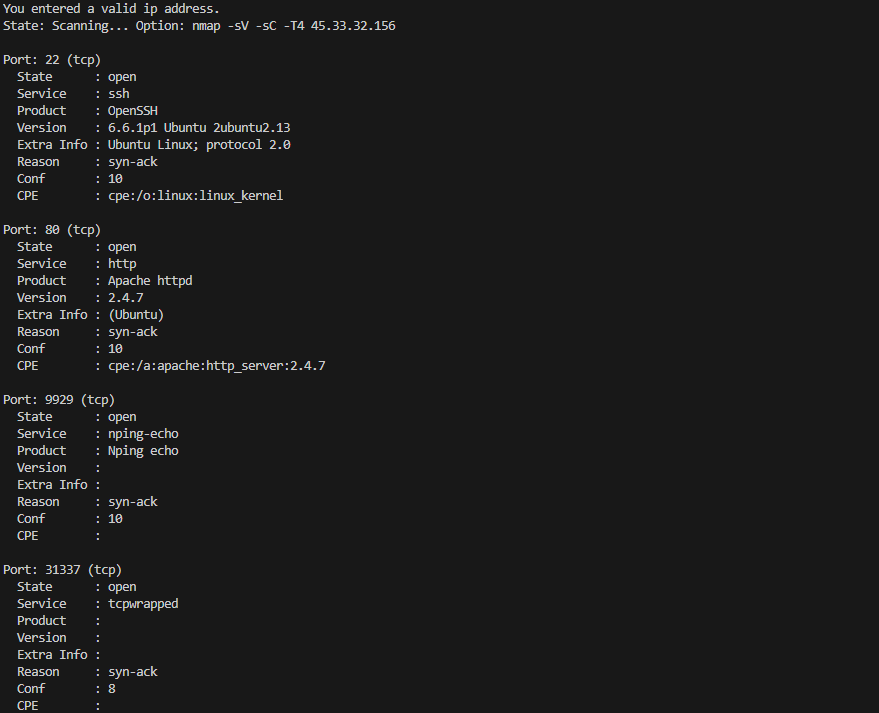

# Nmap Scanner

## Description

Nmap Scanner is a Python-based network scanner that utilizes the powerful Nmap tool to perform detailed network discovery and security assessments. It offers a simple command-line interface to quickly scan single or multiple targets, making it ideal for cybersecurity professionals and enthusiasts.

## Features

* Scan single or multiple targets
* Customize scan options based on Nmap capabilities
* Export scan results to various formats
* Lightweight and easy to use

## Installation

1. Clone the repository:

   ```bash
   git clone https://github.com/UzunKaanA/nmapScanner.git
   ```
2. Navigate to the project directory:

   ```bash
   cd nmapScanner
   ```

## Usage

Run the script with the following command:

```bash
python nmapScanner.py
```

Follow the on-screen instructions to input targets and customize scan options.




## Contributing

Contributions are welcome! If you have any ideas or improvements, feel free to fork the repository and submit a pull request. For major changes, please open an issue first to discuss your proposal.

## License

This project is licensed under the MIT License - see the [LICENSE](LICENSE) file for details.

## Contact

Created by [Kaan Arda Uzun](https://github.com/UzunKaanA) - feel free to reach out!
